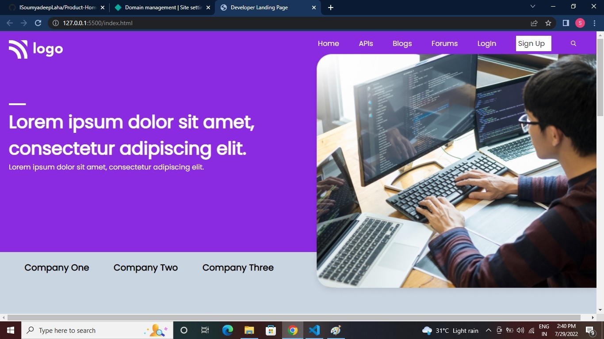

# Developer Landing Page (Project 09)

by Soumyadeep Laha

## Learnings from this project

- Learned about the positioning of image using the CSS position property.
- How to create beautiful cards using the CSS Box Shadow Property and border-radius.
- More on CSS flexbox.

## Time to complete this project 

It almost tooked 4 hours to complete this.

## Screen Shorts of the project

---

---

---

## Live link to the project

[Netlify Link...](https://developer-landing-page-proj09.netlify.app/)